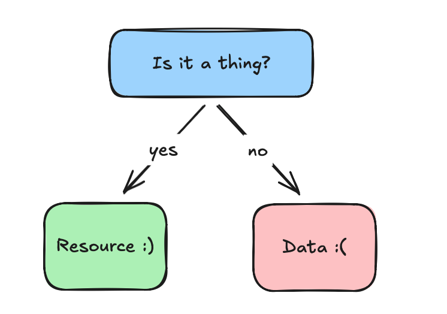

# Everything in Bassline is a resource.

A resource is an addressable thing that can support two kinds of interaction, `get` and `put`.

- `get` is for when a resource can provide us information to use.

- `put` is for when a resource can use information we provide it.

These are the axioms for Bassline. If you find yourself confused, consult the flowchart:

# Why resources?

The dictionary defines a resource as:

> a source of supply or support : an available means — usually used in plural

We chose this name for our core abstraction because it feels general purpose and yet is easily specialized based on usage.

The word doesn't imply a particular implementation or location, which was important to us, because our system is naturally distributed and we need a term that supported this.

# Resource kinds

Resource is a general term, as such we can't really think in abstract resources.

Instead we describe useful patterns of resources based on their properties and intended uses.

The goal of describing these useful patterns is to provide you, dear reader, with a way of thinking about your systems. We keep the descriptions broad as these patterns are just the tip of the iceberg.

There exists a whole world waiting to be discovered!

# Resources for distributed computing

The following resources are most applicable in a distributed setting. Their properties make them a natural and good solution to the problems we face in a distributed setting, when used properly!

This doesn't exclude them from finding use in non-distributed tasks, but they really shine in this kind of setting.

## Cell

A cell is a kind of resource used for storing information about a single thing, similar to a variable in traditional systems.

However unlike a variable, we never fully define what it "is". Instead a cell treats all information as partial, and merges this partial-information in to better understand what the single thing actually is. So a cell tells us the best guess at what something is, based on what it has seen. 

The merge function used by the cell is Associative, Commutative, and Idempotent (ACI):

*We will use the 🤝 to denote merge. So merge(a, b) is (a  🤝  b)*

- Associative

    Meaning that the grouping of `merge` doesn't change the result.
    
    `(a 🤝 b) 🤝 c = a 🤝 (b 🤝 c)`
    
- Commutative

    Meaning the order we apply `merge` in doesn't change the result.
    
    `a 🤝 b = b 🤝 a`
    
- Idempotent

    Meaning that merge can be applied redundantly, without changing the result.
    
    `a 🤝 a = a`
    
Similar to CRDTs, these properties mean we can avoid the normal issues that arise when doing distributed state. As an explicit sequence of operations isn't required, and writers don't need to coordinate when writing.

This is also useful for reactive programming, as we only need to run dependent computations whenever the cell learns something new, not just when we write to it. Since we don't need to recompute if the cell didn't learn something new. In short, cells give us a controlled way to ignore information!

Beyond distributed state
---

Cells are useful not just useful for distributed state, because another way to view a cell, is maintaining a constraint on the system. The merge function allows a cell to gradually learn and enforce constraints on the possible states it can exist in.

Note on "learning"

 
When I use the term learning, I simply am trying to highlight we don't hardcode the constraints when the cell is created, because all cells start off knowing nothing.

But as a cell merges information in and learns more about what it is, it can infer what it cannot be, as certain information excludes other information as being valid.

And when those constraints are not met, the cell is in a state of contradiction. Meaning that two sources of information, cannot coexist, which itself is more information than we started with, meaning that we can spread this information to other resources, to attempt to resolve the contradiction, using some hueristic.

This is extremely useful in a distributed adversarial environment. This feature allows us to maintain a consistent view of a network, because we can explicitly discover when a peer is providing us bad information. 
We could then share this contradiction with peers, as the two contradictory claims are all we need to describe the issue to another peer, without replaying all history or interactions.
Neat!

## Propagator

A propagator, propagates information between things, generally cells, to help us model how information relates in the system.

Propagators behave similar to reactive functions, since they only recompute when an input cell learns some new information, which it will then write to it's output cell(s).

Because propagators are pure functions, they will maintain the properties of cells. Meaning we can write flexible programs that can run in any order by simplying relating cells with propagators.

This becomes powerful since cells can ignore redundant information, which lets us provide multiple redundant ways of computing some results.

This improves the system's robustness, as a failure or delay of one information source doesn't have to stop the rest of the system from progressing.

And if that original information source starts working later, it will automatically validate the constraints from the other sources automatically, because of how cells merge their data in.

**Stubs:**

- Bi-directional computation is a really powerful feature

- Cycles are not just supported, but actively encouraged with propagation networks

- Add more examples

# Other kinds of resources

The following kinds of resources are more general. 

They are not specifically for fully distributed settings. But are useful none the less.

## Oracle

An oracle is a kind of "read-only" resource designed to answer questions.

They can source information in a variety of ways, technically speaking, a cell could be a kind of oracle if we don't write to it.

They can behave similar to database queries, and in fact oracles can serve as a resource representation of a database!

Program evaluation fits the description of an oracle, since we can ask a question such as: "What does this result in?" where the answer is the evaluation result of the program. [Link](../../tcl/src/upgrade.js) showcases a tcl runtime exposed as an oracle.

Most useful systems are filled with oracles, since they let us cleanly ask questions and get answers, without caring about how the oracle directly sources the data.

So if you want to get specific information in your systems in an semi-opaque manner, you should model it as an oracle.

## Scout

A scout is a general kind of resource that models information discovery. It behaves similar to a propagator, however rather than being reactive, it acts autonomously and has hueristics for deciding when something is interesting.

When a scout discovers interesting information, it relays this to other resources in the system.

You should use a scout whenenver your system needs automated search. For example things like peer discovery on p2p networks can be seen as scouts, relaying connection information. Status monitors can be thought of as scouts.

If it is autonomous, looks for specific kinds of information, and shares this information. It's a scout.

## Fuzzy Cells

Fuzzy cells are "cell-ish", since they do accumulation of information. However unlike cells that have specific algebraic properties, we loosen that description to just define fuzzy cells as things that accumulate "good-enuf".

> NOTE: These are not a replacement for cells, and shouldn't be used in distributed settings! They can lose information and do not have the lattice properties that cells have!

They are useful when you need approximations of data, and can deal with slight losses of information. An example of this is when using AI Agents. If we need multiple agents to dump their data somewhere they could reuse it, we also would like to be able to compress the data to get the "gist" or main points.

That is what fuzzy cells are for, digesting larger data sets into a smaller approximation of that data set.

## FAQ
